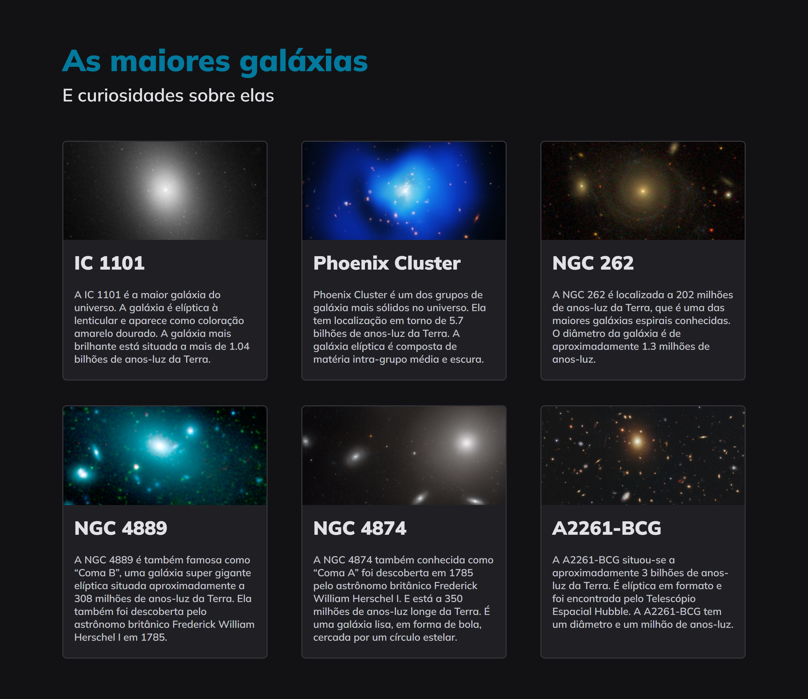

<h1 align="center">Galaxies</h1>

[Projeto](#projeto)
&nbsp;&nbsp;&nbsp;|&nbsp;&nbsp;&nbsp;
[Tecnologias](#tecnologias)
&nbsp;&nbsp;&nbsp;|&nbsp;&nbsp;&nbsp;
[Layout](#layout)
&nbsp;&nbsp;&nbsp;|&nbsp;&nbsp;&nbsp;
[Licença](#license)

  

 

 
 

## 💻 Projeto 

Projeto do Stage 3 do Explorer, mais um dos projetos adicionados após algumas atualizações. O objetivo deste projeto é reforçar a prática de layouts com grid usando HTML e CSS.

Aproveitei para praticar minhas habilidades em responsividades também.

 
 

## 🚀 Tecnologias 

- HTML
- CSS

 
 

## 🔖 Layout 

Você pode visualizar o layout do projeto através [DESSE LINK](https://www.figma.com/community/file/1256354736253234634). É necessário ter conta no [Figma](https://figma.com) para acessá-lo.

 
 

## 🔒 Licença

Esse projeto está sob a licença MIT.

